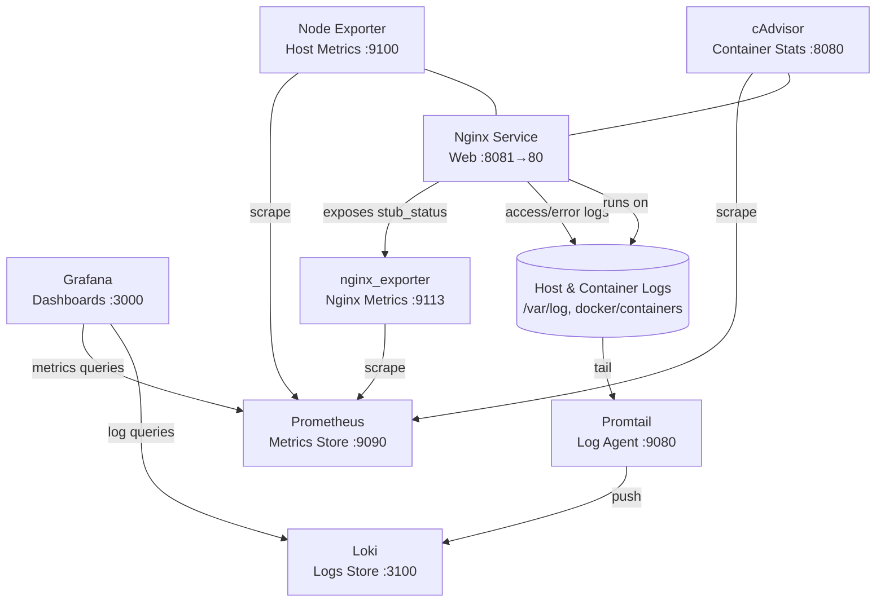

# Prometheus和Grafana监控系统部署与验证

_04 Oct, 2025_

本文覆盖 Prometheus、Grafana、Loki、Promtail 组合的部署步骤与运行校验，可用于在任何具备 Docker 能力的环境快速复现监控与日志栈。

## 架构图


## 组件与端口
| 组件 | 职责 | 暴露端口 |
| --- | --- | --- |
| Prometheus | 指标采集与存储 | `9090/tcp`
| cAdvisor | Docker 容器与宿主机指标 | `8080/tcp`
| Node Exporter | 宿主机指标 | `9100/tcp`
| Grafana | 指标与日志可视化 | `3000/tcp`
| Loki | 日志聚合 | `3100/tcp`
| Promtail | 日志采集 Agent | `9080/tcp`（容器内）
| Nginx | 示例业务服务 | `8081->80/tcp`
| nginx_exporter | Nginx 指标暴露 | `9113/tcp`

## 目录结构
```
docker-compose/
│── docker-compose.base.yml
│── docker-compose.monitoring.yml
│── docker-compose.grafana.yml
│── docker-compose.logging.yml
│── docker-compose.app.yml
│── prometheus/
│    └── prometheus.yml
│── grafana/
│    └── datasources.yml
│── promtail-config.yml
│── nginx/
│    └── nginx.conf
│── prometheusgrafana.html
│── README.md
```

## 环境要求
- 测试时间：2025-10-04（UTC）
- 已安装 Docker Engine 与 Docker Compose V2
- 命令均在本目录执行，Linux/Unix shell 环境

## 配置清单
如需自定义，可在部署前调整下列文件。

### docker-compose.base.yml
```yaml
version: '3.8'

networks:
  monitoring:
    driver: bridge

volumes:
  grafana-data:
```

### docker-compose.monitoring.yml
```yaml
version: '3.8'

services:
  prometheus:
    image: prom/prometheus:latest
    container_name: prometheus
    ports:
      - "9090:9090"
    volumes:
      - ./prometheus:/etc/prometheus
    command:
      - '--config.file=/etc/prometheus/prometheus.yml'
    networks:
      - monitoring

  cadvisor:
    image: gcr.io/cadvisor/cadvisor:latest
    container_name: cadvisor
    ports:
      - "8080:8080"
    volumes:
      - /:/rootfs:ro
      - /var/run:/var/run:rw
      - /sys:/sys:ro
      - /var/lib/docker/:/var/lib/docker:ro
      - /cgroup:/cgroup:ro
    networks:
      - monitoring

  node_exporter:
    image: prom/node-exporter:latest
    container_name: node_exporter
    ports:
      - "9100:9100"
    networks:
      - monitoring
```

### prometheus/prometheus.yml
```yaml
global:
  scrape_interval: 5s

scrape_configs:
  - job_name: 'prometheus'
    static_configs:
      - targets: ['prometheus:9090']

  - job_name: 'node_exporter'
    static_configs:
      - targets: ['node_exporter:9100']

  - job_name: 'cadvisor'
    static_configs:
      - targets: ['cadvisor:8080']
```

### docker-compose.grafana.yml
```yaml
version: '3.8'

services:
  grafana:
    image: grafana/grafana:latest
    container_name: grafana
    ports:
      - "3000:3000"
    volumes:
      - ./grafana:/etc/grafana/provisioning/datasources
      - grafana-data:/var/lib/grafana
    environment:
      - GF_SECURITY_ADMIN_PASSWORD=admin
    networks:
      - monitoring
```

### docker-compose.logging.yml
```yaml
version: '3.8'

services:
  loki:
    image: grafana/loki:latest
    container_name: loki
    ports:
      - "3100:3100"
    command: -config.file=/etc/loki/local-config.yaml
    networks:
      - monitoring

  promtail:
    image: grafana/promtail:latest
    container_name: promtail
    volumes:
      - /var/log:/var/log
      - /var/lib/docker/containers:/var/lib/docker/containers
      - ./promtail-config.yml:/etc/promtail/promtail-config.yml
    command: -config.file=/etc/promtail/promtail-config.yml
    networks:
      - monitoring
```

### docker-compose.app.yml
```yaml
version: '3.8'

services:
  nginx:
    image: nginx:1.25-alpine
    container_name: nginx
    ports:
      - "8081:80"
    volumes:
      - ./nginx/nginx.conf:/etc/nginx/nginx.conf:ro
    networks:
      - monitoring

  nginx_exporter:
    image: nginx/nginx-prometheus-exporter:0.11.0
    container_name: nginx_exporter
    command:
      - -nginx.scrape-uri=http://nginx/stub_status
    ports:
      - "9113:9113"
    depends_on:
      - nginx
    networks:
      - monitoring
```

### nginx/nginx.conf
```nginx
worker_processes auto;

error_log /var/log/nginx/error.log warn;

pid /var/run/nginx.pid;

events {
    worker_connections 1024;
}

http {
    include       /etc/nginx/mime.types;
    default_type  application/octet-stream;

    sendfile        on;
    keepalive_timeout  65;

    server {
        listen 80;
        server_name _;

        location / {
            root   /usr/share/nginx/html;
            index  index.html index.htm;
        }

        location /stub_status {
            stub_status;
            access_log off;
            allow all;
        }
    }
}
```

### grafana/datasources.yml
```yaml
apiVersion: 1

datasources:
  - name: Prometheus
    type: prometheus
    access: proxy
    url: http://prometheus:9090
    isDefault: true
  - name: Loki
    type: loki
    access: proxy
    url: http://loki:3100
```

### promtail-config.yml
```yaml
server:
  http_listen_port: 9080
  grpc_listen_port: 0

positions:
  filename: /tmp/positions.yaml

clients:
  - url: http://loki:3100/loki/api/v1/push

scrape_configs:
  - job_name: system-logs
    static_configs:
      - targets:
          - localhost
        labels:
          job: varlogs
          host: ${HOSTNAME}
          __path__: /var/log/*log

  - job_name: docker-containers
    static_configs:
      - targets:
          - localhost
        labels:
          job: containers
          host: ${HOSTNAME}
          __path__: /var/lib/docker/containers/*/*.log
```

## 部署流程
以下命令可单独或一次性启动所有组件，默认使用 `monitoring` 网络与 `grafana-data` 卷。

### 启动监控组件
```bash
docker compose \
  -f docker-compose.base.yml \
  -f docker-compose.monitoring.yml up -d
```

### 启动 Grafana
```bash
docker compose \
  -f docker-compose.base.yml \
  -f docker-compose.grafana.yml up -d
```
Grafana 默认账号 `admin` / `admin`，首次登录后请修改密码。

### 启动日志组件
```bash
docker compose \
  -f docker-compose.base.yml \
  -f docker-compose.logging.yml up -d
```
Promtail 通过配置文件自动采集宿主机与容器日志并推送到 Loki。

### 启动示例服务（Nginx）
```bash
docker compose \
  -f docker-compose.base.yml \
  -f docker-compose.app.yml up -d
```
示例服务默认监听 `http://localhost:8081`，Nginx exporter 暴露指标 `http://localhost:9113/metrics`。

### 一次性启动全部组件
```bash
docker compose \
  -f docker-compose.base.yml \
  -f docker-compose.monitoring.yml \
  -f docker-compose.grafana.yml \
  -f docker-compose.logging.yml \
  -f docker-compose.app.yml up -d
```

### 停止与清理（可选）
```bash
docker compose \
  -f docker-compose.base.yml \
  -f docker-compose.monitoring.yml \
  -f docker-compose.grafana.yml \
  -f docker-compose.logging.yml \
  -f docker-compose.app.yml down
```
命令不会自动删除 `grafana-data` 卷，如需释放空间请手动移除。

## 验证步骤
确保容器在本目录下启动。

### Compose 服务状态
```bash
docker compose \
  -f docker-compose.base.yml \
  -f docker-compose.monitoring.yml \
  -f docker-compose.grafana.yml \
  -f docker-compose.logging.yml ps
```
预期所有服务状态为 `Up`，端口映射符合组件表。

### Prometheus 与 Node Exporter
```bash
curl -sSf http://localhost:9090/-/ready
curl -sSf http://localhost:9100/metrics | head -n 5
```
- `/ready` 返回 `Prometheus Server is Ready.`
- `9100/metrics` 输出 `# HELP` 等指标内容。

### cAdvisor
```bash
curl -sSf http://localhost:8080/healthz
```
返回 `ok` 即表示健康。

### Grafana
```bash
curl -s http://localhost:3000/login | head -n 5
curl -sSf http://localhost:3000/api/health
```
- 登录页返回 HTML 头部。
- `/api/health` 返回 `{"database":"ok",...}` JSON。

### Loki
```bash
curl -sSf http://localhost:3100/ready
curl -s "http://localhost:3100/loki/api/v1/labels"
```
- `/ready` 返回 `ready`
- `labels` 接口状态为 `success`

### 示例服务（Nginx）
```bash
curl -sSf http://localhost:8081 | head -n 5
```
默认首页返回 Nginx 欢迎页面片段。

### Nginx Exporter
```bash
curl -sSf http://localhost:9113/metrics | head -n 5
```
预期包含 `# HELP nginx_up` 等指标行。

### 自动化验证脚本
```bash
./scripts/verify-stack.sh
```
脚本会依次请求上述关键端点并汇总当前 Nginx 连接数、请求等指标。

### Nginx 压力测试脚本
```bash
./scripts/nginx-bench.sh -c 50 -d 20s -t 4 -u http://localhost:8081/
```
脚本会优先调用 `hey`（若无则 `wrk`，再退到 `ab`），支持通过选项或环境变量调整 URL、并发数、压测时长/请求数、线程数。

### Promtail
Promtail 端口未映射到宿主机，可借助 Grafana 容器验证：
```bash
docker exec grafana curl -sSf http://promtail:9080/ready
```
返回 `Ready` 表示采集 Agent 正常。

### 日志推送验证（可选）
```bash
docker compose -f docker-compose.base.yml -f docker-compose.logging.yml logs --tail 20 promtail
docker exec grafana curl -s \
  "http://loki:3100/loki/api/v1/query?query={job=\"varlogs\"}&limit=5"
```
预期日志包含 `tail routine: started`；查询结果返回带 `streams` 与 `values` 字段的 JSON。

## 日常运维建议
- **镜像更新**：执行 `docker compose ... pull` 后再 `up -d` 滚动更新。
- **数据持久化**：Grafana 使用 `grafana-data` 卷；如需持久化 Prometheus/Loki/Nginx 日志，请在 Compose 中追加卷映射。
- **安全加固**：修改 Grafana 默认密码、为外部访问配置 HTTPS 反向代理、使用防火墙限制端口暴露。

## 最近验证快照
- `docker compose ps` 显示监控、日志与示例服务组件均为 `Up`，端口映射正确。
- Prometheus `/-/ready`、cAdvisor `/healthz`、Grafana `/api/health`、Loki `/ready`、Promtail `/ready` 均返回健康状态。
- Loki `labels` API 返回 `job`、`host`、`filename` 等标签。
- Promtail 日志包含 `tail routine: started`，确认持续采集宿主与容器日志。
- 示例服务 Nginx 可通过 `http://localhost:8081` 访问，`nginx_exporter` 指标中 `nginx_up` 为 `1`。
